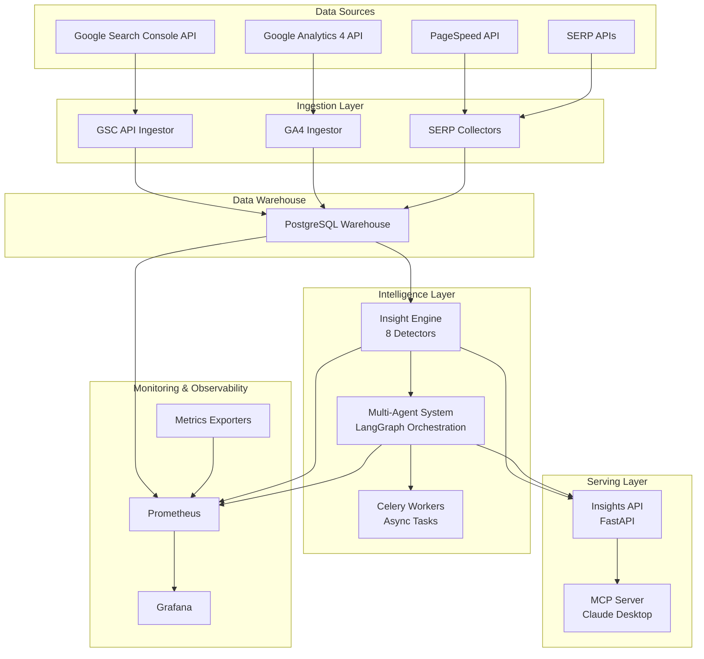

# System Architecture

## Overview

The GSC Data Warehouse is a microservices-based data platform designed for reliability, scalability, and maintainability. All services run in Docker containers with health checks and automatic restarts.

## Architecture Principles

1. **Separation of Concerns**: Each service has a single, well-defined responsibility
2. **Idempotency**: All operations can be safely retried
3. **Observability**: Comprehensive logging, metrics, and health checks
4. **Resilience**: Automatic retries, backoff, and graceful degradation
5. **Security**: Docker secrets, isolated networks, no exposed credentials

## System Diagram

```
┌─────────────────────────────────────────────────────┐
│                 External Systems                     │
├─────────────────────────────────────────────────────┤
│  Google Search Console API                          │
│  └─ Properties, Pages, Queries, Metrics             │
└──────────────────┬──────────────────────────────────┘
                   │
                   ▼
    ┌──────────────────────────────┐
    │      API Ingestor Service    │
    │  ┌────────────────────────┐  │
    │  │  Enterprise Rate       │  │
    │  │  Limiter               │  │
    │  │  - Token Bucket        │  │
    │  │  - Exp. Backoff        │  │
    │  │  - Per-Property Track  │  │
    │  └────────────────────────┘  │
    │  ┌────────────────────────┐  │
    │  │  Data Transformer      │  │
    │  │  - API → Warehouse     │  │
    │  │  - Validation          │  │
    │  └────────────────────────┘  │
    └────────────┬─────────────────┘
                 │
                 ▼
         ┌───────────────┐
         │   PostgreSQL  │
         │   Warehouse   │
         ├───────────────┤
         │ gsc schema    │
         │ - Properties  │
         │ - Facts       │
         │ - Watermarks  │
         │ - Audit Log   │
         └───────┬───────┘
                 │
    ┌────────────┴────────────┐
    │                         │
    ▼                         ▼
┌─────────────┐       ┌──────────────┐
│ Transformer │       │  Analytical  │
│  Service    │──────►│    Views     │
├─────────────┤       ├──────────────┤
│ SQL DDL     │       │ Page Health  │
│ View Mgmt   │       │ Query Trends │
│             │       │ Directories  │
│             │       │ Brand Split  │
└─────────────┘       └──────┬───────┘
                             │
              ┌──────────────┼──────────────┐
              │              │              │
              ▼              ▼              ▼
      ┌───────────┐  ┌──────────┐  ┌──────────┐
      │    MCP    │  │ Insights │  │  Direct  │
      │  Server   │  │   API    │  │   SQL    │
      ├───────────┤  ├──────────┤  ├──────────┤
      │ Port 8000 │  │ Port 8001│  │ Port 5432│
      │ Tools API │  │ REST API │  │ psql     │
      └─────┬─────┘  └────┬─────┘  └────┬─────┘
            │             │              │
            ▼             ▼              ▼
    ┌─────────────────────────────────────────┐
    │          Client Applications            │
    ├─────────────────────────────────────────┤
    │ • Claude Desktop                        │
    │ • ChatGPT Plugins                       │
    │ • Custom Dashboards                     │
    │ • SQL Clients                           │
    │ • BI Tools                              │
    └─────────────────────────────────────────┘

         ┌──────────────────┐
         │   Scheduler      │
         │   Service        │
         ├──────────────────┤
         │ Daily: 12PM PKT  │
         │  (07:00 UTC)     │
         │  - API Ingest    │
         │  - Transforms    │
         │  - Insights      │
         │                  │
         │ Weekly: Mon      │
         │  12PM PKT        │
         │  - Reconcile     │
         │  - Analysis      │
         └──────────────────┘

         ┌──────────────────┐
         │  Observability   │
         ├──────────────────┤
         │ Metrics Exporter │
         │ Port 9090        │
         │       ▼          │
         │  Prometheus      │
         │  Port 9091       │
         │       ▼          │
         │  (Future)        │
         │  Grafana         │
         │  Alertmanager    │
         └──────────────────┘
```

## Services

### 1. Warehouse (PostgreSQL)

**Purpose**: Central data store for all GSC data

**Technology**: PostgreSQL 15 Alpine

**Responsibilities**:
- Store raw GSC data
- Maintain watermarks and audit logs
- Host analytical views
- Provide ACID guarantees

**Key Features**:
- UPSERT logic for idempotency
- Composite primary keys
- 7 indexes on fact table
- Automatic timestamp management
- Health checks via pg_isready

**Configuration**:
```yaml
environment:
  POSTGRES_DB: gsc_db
  POSTGRES_USER: gsc_user
  POSTGRES_PASSWORD_FILE: /run/secrets/db_password
ports:
  - "5432:5432"
volumes:
  - warehouse_data:/var/lib/postgresql/data
```

### 2. API Ingestor

**Purpose**: Fetch data from Google Search Console API

**Technology**: Python 3.11

**Responsibilities**:
- Connect to GSC API
- Apply enterprise rate limiting
- Transform API responses
- Upsert to warehouse
- Track watermarks

**Key Features**:
- Token bucket rate limiting
- Exponential backoff
- Per-property tracking
- Automatic retry logic
- Comprehensive error handling

**Configuration**:
```yaml
environment:
  REQUESTS_PER_MINUTE: 30
  REQUESTS_PER_DAY: 2000
  BURST_SIZE: 5
  API_COOLDOWN_SEC: 2
  GSC_API_MAX_RETRIES: 5
```

### 3. Transformer

**Purpose**: Create and refresh analytical views

**Technology**: Python 3.11

**Responsibilities**:
- Execute SQL DDL
- Create views
- Refresh materialized views (future)
- Validate view integrity

**Configuration**:
```yaml
volumes:
  - ./transform:/app
  - ./sql:/sql:ro
```

### 4. MCP Server

**Purpose**: Provide AI agent integration via Model Context Protocol

**Technology**: Python 3.11 + FastAPI

**Responsibilities**:
- Expose MCP tools
- Query warehouse
- Format responses for LLMs
- Handle tool invocations

**Endpoints**:
- `GET /health` - Health check
- `POST /call-tool` - Tool invocation
- `GET /tools` - List available tools

**Configuration**:
```yaml
ports:
  - "8001:8001"
environment:
  MCP_VERSION: "2025-01-18"
```

### 5. Scheduler

**Purpose**: Orchestrate automated pipeline execution

**Technology**: Python 3.11 + APScheduler

**Responsibilities**:
- Run daily data ingestion pipeline
- Execute weekly maintenance tasks
- Refresh insights multiple times daily
- Log execution metrics to Prometheus

---

## Operations Schedule

All times shown in **Pakistan Standard Time (PKT, UTC+5)**.

### Daily Pipeline (12:00 PM PKT / 7:00 AM UTC)

| Task | Description |
|------|-------------|
| **API Ingestion** | GSC data collection from Google Search Console API |
| **GA4 Collection** | Google Analytics 4 metrics (sessions, pageviews, conversions) |
| **SERP Collection** | Search position tracking via SerpStack API |
| **CWV Collection** | Core Web Vitals via PageSpeed Insights API |
| **SQL Transforms** | Aggregation views, URL normalization, metrics calculation |
| **Insights Refresh** | Anomaly detection, opportunities, risks analysis |
| **Hugo Content Sync** | Sync GSC/GA4 data with Hugo markdown files |
| **Content Action Execution** | Process approved SEO optimization actions |
| **Trends Collection** | Google Trends data for tracked keywords |
| **Watermark Check** | Verify data freshness and watermark status |

### Insights Refresh (4x Daily)

| Time (PKT) | Time (UTC) | Description |
|------------|------------|-------------|
| 6:00 AM | 1:00 AM | Early morning refresh |
| 12:00 PM | 7:00 AM | Included in daily pipeline |
| 6:00 PM | 1:00 PM | Evening refresh |
| 12:00 AM | 7:00 PM | Midnight refresh |

### Weekly Maintenance (Monday 12:00 PM PKT / 7:00 AM UTC)

| Task | Description |
|------|-------------|
| **Watermark Reconciliation** | Fix gaps where watermarks advanced ahead of actual data |
| **Data Reconciliation** | Re-fetch last 7 days of data to fill any gaps |
| **SQL Transforms Refresh** | Full refresh of all aggregation views |
| **Cannibalization Refresh** | Detect pages competing for same keywords |
| **Content Analysis** | Deep content quality analysis |

### Testing Commands

```bash
# Run daily pipeline manually
docker exec gsc_scheduler python scheduler/scheduler.py --test-daily

# Run weekly maintenance manually
docker exec gsc_scheduler python scheduler/scheduler.py --test-weekly

# Run specific tasks
docker exec gsc_scheduler python scheduler/scheduler.py --test-hugo
docker exec gsc_scheduler python scheduler/scheduler.py --test-insights
docker exec gsc_scheduler python scheduler/scheduler.py --test-watermark-reconciliation

# Show scheduled jobs without running
docker exec gsc_scheduler python scheduler/scheduler.py --dry-run
```

---

**Configuration**:
```yaml
environment:
  TZ: UTC
  ONESHOT: false  # Set true for testing
```

### 6. Insights API

**Purpose**: REST API for dashboards and applications

**Technology**: Python 3.11 + FastAPI

**Endpoints**:
- `GET /api/health` - Health check
- `GET /api/page-health` - Page performance
- `GET /api/query-trends` - Query trends
- `GET /api/directory-trends` - Directory stats
- `GET /api/brand-nonbrand` - Brand analysis

**Configuration**:
```yaml
ports:
  - "8001:8001"
environment:
  API_VERSION: "1.0.0"
```

### 7. Metrics Exporter

**Purpose**: Export Prometheus metrics

**Technology**: Python 3.11 + Flask

**Metrics**:
- Rate limiter statistics
- Database health
- Task execution
- Data freshness

**Configuration**:
```yaml
ports:
  - "9090:9090"
environment:
  METRICS_PORT: 9090
```

### 8. Prometheus

**Purpose**: Metrics collection and storage

**Technology**: Prometheus

**Configuration**:
```yaml
ports:
  - "9091:9090"
volumes:
  - prometheus_data:/prometheus
```

## Data Flow

### Ingestion Flow

```
1. Scheduler triggers → API Ingestor
2. API Ingestor:
   a. Checks watermarks
   b. Acquires rate limit permission
   c. Calls GSC API
   d. Transforms response
   e. Upserts to warehouse
   f. Updates watermarks
3. Transformer:
   a. Refreshes analytical views
   b. Validates integrity
4. Services:
   a. MCP/API serve fresh data
```

### Query Flow

```
1. Client → MCP Server/Insights API
2. Service:
   a. Validates request
   b. Queries warehouse views
   c. Formats response
3. Client ← Response
```

## Networking

### Network Topology

```
┌─────────────────────────────────────┐
│         gsc_network (bridge)        │
├─────────────────────────────────────┤
│                                     │
│  ┌──────────┐    ┌──────────┐     │
│  │warehouse │◄───│api_ingest│     │
│  └────┬─────┘    └──────────┘     │
│       │                             │
│       ├──────────┬──────────┐      │
│       ▼          ▼          ▼      │
│  ┌────────┐ ┌────────┐ ┌────────┐ │
│  │  mcp   │ │insights│ │ sched  │ │
│  └────────┘ └────────┘ └────────┘ │
│                                     │
└─────────────────────────────────────┘
       │                  │
       ▼                  ▼
    Port 8000         Port 8001
    (External)        (External)
```

### Security

1. **Isolated Network**: All services on private bridge network
2. **Secrets Management**: Credentials via Docker secrets
3. **Minimal Exposure**: Only necessary ports exposed
4. **No Root**: Services run as non-root users
5. **Read-Only Mounts**: Configuration as read-only

## Scalability

### Current Capacity

- **Data Volume**: 1M+ rows
- **Properties**: Unlimited
- **Throughput**: 30 req/min sustained
- **Daily Quota**: 2000 requests

### Scaling Strategies

#### Vertical Scaling
```yaml
# Increase resources
services:
  warehouse:
    deploy:
      resources:
        limits:
          cpus: '2'
          memory: 4G
```

#### Horizontal Scaling
```yaml
# Multiple ingestors
services:
  api_ingestor_1:
    environment:
      PROPERTY_GROUP: "group1"
  api_ingestor_2:
    environment:
      PROPERTY_GROUP: "group2"
```

#### Database Scaling
- Read replicas for queries
- Partitioning by date
- Archiving old data

## Reliability

### Health Checks

All services implement health checks:

```yaml
# Insights API (port 8000)
healthcheck:
  test: ["CMD", "curl", "-f", "http://localhost:8000/api/health"]
  interval: 30s
  timeout: 10s
  retries: 3

# MCP Server (port 8001)
healthcheck:
  test: ["CMD", "curl", "-f", "http://localhost:8001/health"]
  interval: 30s
  timeout: 10s
  retries: 3
```

### Restart Policies

```yaml
restart: unless-stopped  # Core services
restart: "no"           # One-shot jobs
```

### Data Integrity

- UPSERT prevents duplicates
- Watermarks track progress
- Audit logs record changes
- Idempotent operations

## Monitoring

### Logs

```bash
# All logs centralized
docker compose logs -f

# Service-specific
docker compose logs -f api_ingestor

# Filter by level
docker compose logs | grep ERROR
```

### Metrics

```bash
# Prometheus metrics
curl http://localhost:9091/metrics

# Custom metrics
curl http://localhost:9090/metrics
```

### Alerts (Future)

```yaml
# alertmanager.yml
groups:
  - name: gsc_alerts
    rules:
      - alert: HighThrottleRate
        expr: gsc_api_throttle_rate > 0.1
        annotations:
          summary: "High API throttle rate"
```

## Deployment Patterns

### Development
```bash
docker compose up -d warehouse mcp
# Manual testing
```

### Staging
```bash
docker compose up -d \
  --profile ingestion \
  --profile api
# Automated testing
```

### Production
```bash
docker compose up -d \
  --profile ingestion \
  --profile scheduler \
  --profile api \
  --profile observability
# Full monitoring
```

## Security Considerations

1. **Secrets**: Never commit secrets to repository
2. **Network**: Use isolated bridge network
3. **Passwords**: Strong passwords in production
4. **TLS**: Enable TLS for exposed services
5. **Updates**: Regular security updates
6. **Logs**: Sanitize sensitive data in logs

## Performance Optimization

### Database
- Indexes on frequently queried columns
- Vacuum and analyze regularly
- Connection pooling
- Query optimization

### Rate Limiting
- Tune based on actual quota usage
- Monitor throttle rates
- Adjust burst size for workload

### Caching
- Cache analytical views
- Materialize views for heavy queries
- Cache MCP responses

## Disaster Recovery

### Backups

```bash
# Backup database
docker compose exec warehouse pg_dump \
  -U gsc_user gsc_db > backup.sql

# Backup volumes
docker run --rm -v gsc_warehouse_data:/data \
  -v $(pwd):/backup alpine \
  tar czf /backup/warehouse_data.tar.gz /data
```

### Restore

```bash
# Restore database
docker compose exec -T warehouse psql \
  -U gsc_user gsc_db < backup.sql

# Restore volumes
docker run --rm -v gsc_warehouse_data:/data \
  -v $(pwd):/backup alpine \
  tar xzf /backup/warehouse_data.tar.gz -C /data
```

---

## Additional System Overview Details

### System Architecture Diagram (Mermaid)



### Intelligence Layer Details

#### Insight Detectors

The system includes 8 specialized detectors:

1. **AnomalyDetector** - Traffic and conversion anomalies
2. **CannibalizationDetector** - Keyword cannibalization issues
3. **ContentQualityDetector** - Content quality metrics
4. **CWVQualityDetector** - Core Web Vitals performance
5. **DiagnosisDetector** - Root cause analysis
6. **OpportunityDetector** - Optimization opportunities
7. **TopicStrategyDetector** - Topic coverage analysis
8. **TrendDetector** - Gradual traffic trends

**Key Files:**
- `insights_core/detectors/*.py` - Individual detector implementations
- `insights_core/repository.py` - Insight CRUD with deterministic IDs
- `services/tasks.py` - Celery task definitions

#### Multi-Agent System Architecture

LangGraph-based orchestration with specialist agents:

```
                    +-------------------+
                    | SupervisorAgent   |
                    | (Orchestrator)    |
                    +--------+----------+
                         |
     +--------------------+--------------------+
     |                    |                    |
+-------v--------+  +--------v-------+  +--------v--------+
| SerpAnalyst    |  | Performance    |  | ContentOptimizer|
| Agent          |  | Agent          |  | Agent           |
+----------------+  +----------------+  +-----------------+
     |                    |                    |
     +--------------------+--------------------+
                         |
                    +--------v--------+
                    | ImpactValidator |
                    | Agent           |
                    +-----------------+
```

**Workflow Types:**
- `daily_analysis` - Automated health checks
- `emergency_response` - React to sudden changes
- `optimization` - Implement improvements
- `validation` - Verify intervention success

**Key Files:**
- `agents/orchestration/supervisor_agent.py` - LangGraph workflow coordinator
- `agents/orchestration/*_agent.py` - Specialist agent implementations
- `agents/base/agent_contract.py` - Base agent interface

### Celery Task Flow

```
+-------------------+     +------------------+
|   Task Triggers   |     |     Redis        |
| - API calls       |---->| Broker (0)       |
| - Scheduler       |     | Backend (1)      |
| - Celery Beat     |     +--------+---------+
+-------------------+              |
                                   |
                         +--------v--------+
                         | Celery Worker   |
                         | (4 concurrent)  |
                         +--------+--------+
                                   |
     +----------------------------+----------------------------+
     |              |              |              |             |
+-----v----+  +------v-----+  +-----v-----+  +-----v----+  +-----v----+
|Embeddings|  |Forecasting |  |SERP Track |  |CWV Mon   |  |Multi-    |
|Generation|  |& Anomaly   |  |& Alerts   |  |& Alerts  |  |Agent     |
+----------+  +------------+  +-----------+  +----------+  |Workflows |
                                                       +----------+
```

### Database Schema Organization

| Schema | Purpose | Key Tables |
|--------|---------|------------|
| `gsc` | Core GSC data | `fact_gsc_daily`, `insights`, `agent_*` |
| `content` | Content analysis | `page_snapshots`, `topics` |
| `forecasts` | Predictions | `forecasts`, `anomalies` |
| `serp` | SERP tracking | `rankings`, `competitors` |
| `performance` | CWV data | `cwv_measurements` |
| `analytics` | GA4 data | `fact_ga4_daily` |
| `automation` | Auto-PR | `pull_requests`, `interventions` |
| `notifications` | Alerts | `alerts`, `alert_rules`, `notification_queue` |
| `orchestration` | Multi-agent | `workflows`, `workflow_steps` |
| `trends` | Google Trends | `interest_over_time`, `related_queries` |

### APScheduler Tasks

> **Note**: The system uses APScheduler (not Celery) for task scheduling. All tasks are bundled into the daily pipeline and weekly maintenance jobs. See [Operations Schedule](#operations-schedule) for complete details.

| Job | Schedule (PKT) | Tasks Included |
|-----|----------------|----------------|
| **Daily Pipeline** | 12:00 PM Mon-Sun | GSC, GA4, SERP, CWV, Transforms, Insights, Hugo, Trends |
| **Insights Refresh** | 6 AM, 6 PM, 12 AM | Anomaly detection, opportunities, risks |
| **Weekly Maintenance** | Monday 12:00 PM | Reconciliation, Cannibalization, Content Analysis |

---

*Last Updated: November 2025*
